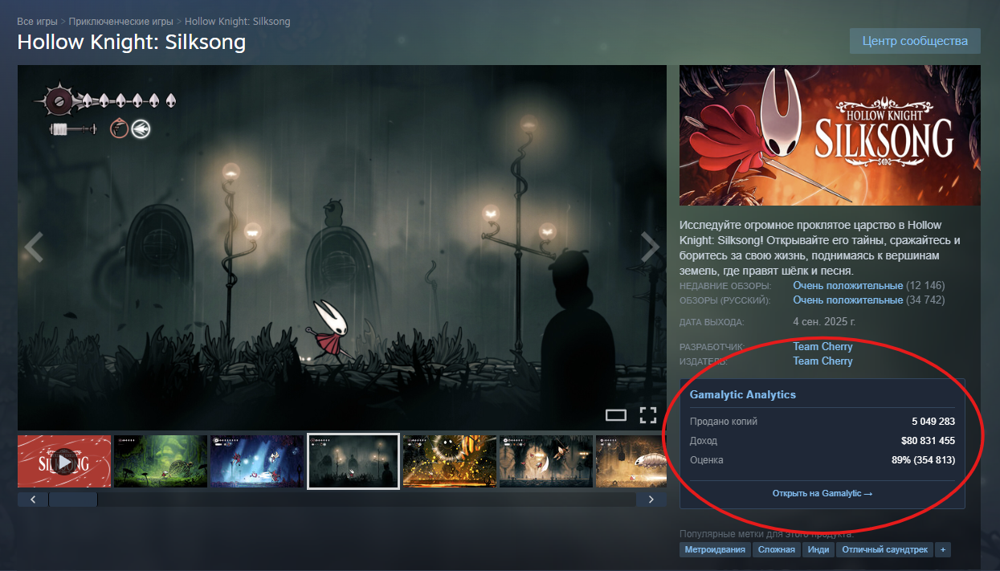

# Steam Gamalytic Embedded Block

A Chrome extension that adds Gamalytic game analytics data as an embedded block on Steam store pages.

Fork from https://github.com/batiali/steam-gamalytic-overlay

## Features

-   Displays game analytics (copies sold, revenue, review scores) directly on Steam store pages
-   Shows wishlist data for unreleased games
-   Click the overlay to open the full game page on Gamalytic
-   Works on any Steam app page (`https://store.steampowered.com/app/*`)

## Installation (Developer Mode)

1. **Download or clone this repository**

    ```bash
    git clone https://github.com/Korveen/Steam-Gamalytic-Embedded-Extension.git
    cd steam-gamalytic-overlay
    ```

2. **Open Chrome Extensions page**

    - Go to `chrome://extensions/`
    - Enable "Developer mode" (toggle in top-right corner)

3. **Load the extension**

    - Click "Load unpacked"
    - Select the project folder (`steam-gamalytic-overlay`)
    - The extension should now appear in your extensions list

4. **Use the extension**
    - Navigate to any Steam game page (e.g., `https://store.steampowered.com/app/730/`)
    - Look for the Gamalytic's embedded data block in the right Steam information block

## Screenshots

**Default View:**


## How it works

The extension automatically detects when you're viewing a Steam app page and:

-   Extracts the App ID from the URL
-   Fetches analytics data from the Gamalytic API
-   Displays key metrics in a floating overlay
-   Shows different data for released vs unreleased games

## Permissions

-   `storage`: For caching the responses.
-   `https://store.steampowered.com/*`: To inject content on Steam pages
-   `https://api.gamalytic.com/*`: To fetch game analytics data

## Caching

The extension uses smart caching to reduce API calls and show data changes:

-   **First visit**: Fetches fresh data from Gamalytic API
-   **Within 24 hours**: Shows cached data with "Cached X ago" indicator
-   **After 24 hours**: Fetches fresh data and compares with previous visit
-   **Differences**: Shows changes since last visit (green for increases, red for decreases)

This means fewer API calls while still showing meaningful updates when you revisit games.
